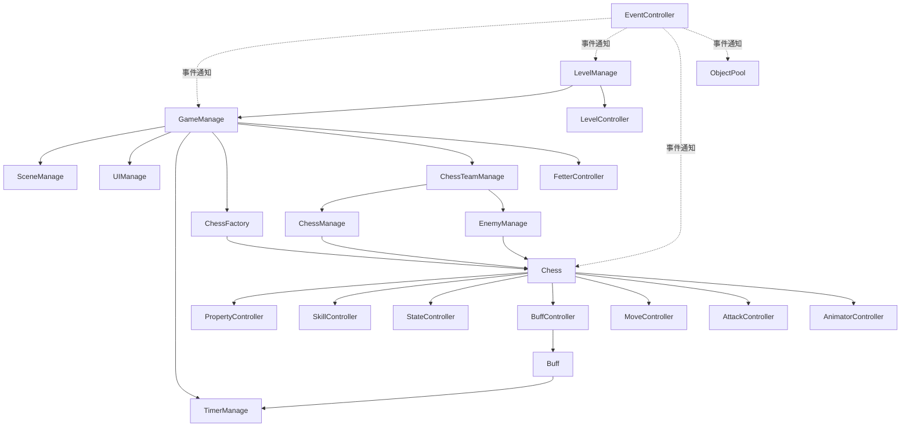

# 依赖关系图谱

## 模块依赖矩阵

| 模块 | GameManage | Chess | LevelSystem | Event | Buff | UI | ObjectPool |
|------|:----------:|:-----:|:-----------:|:-----:|:----:|:--:|:----------:|
| GameManage | - | ✅调用 | ✅调用 | ✅触发 | ❌ | ✅调用 | ✅拥有 |
| Chess | ✅获取 | - | ❌ | ✅触发 | ✅拥有 | ✅调用 | ❌ |
| LevelSystem | ✅调用 | ✅调用 | - | ✅触发 | ❌ | ✅调用 | ❌ |
| Event | ❌ | ❌ | ❌ | - | ❌ | ❌ | ❌ |
| Buff | ✅Timer | ✅作用 | ❌ | ❌ | - | ❌ | ✅创建 |
| UI | ❌ | ✅显示 | ❌ | ❌ | ❌ | - | ❌ |
| ObjectPool | ❌ | ❌ | ❌ | ✅监听 | ❌ | ❌ | - |

图例: ✅=有依赖, ❌=无依赖

## 关键依赖链

```
游戏主流程:
GameManage → LevelManage → LevelController → ChessManage → Chess

属性计算:
Chess.AttackController → DamageMessage → PropertyController → UI.DamagePanel

Buff 流程:
BuffController → Buff → TimerManage → Event → Buff.BuffOver

事件通信:
任意模块 → EventController → 其他模块
```

## 核心依赖图 (Mermaid)



## 依赖风险点

| 风险 | 说明 | 建议 |
|-----|------|------|
| 单例过度集中 | 所有功能依赖 GameManage | 考虑分层架构 |
| 循环依赖风险 | Chess ↔ Buff 可能循环 | 通过事件解耦 |
| 强耦合 UI | 部分模块直接调用 UI | 使用事件中转 |
| 测试困难 | 单例难以 Mock | 提供接口抽象 |

## 依赖关系建议

1. **新增功能**: 优先通过 EventController 通信
2. **数据获取**: 使用接口而非直接访问单例
3. **模块边界**: 保持 Chess 内部自治，减少外部依赖
