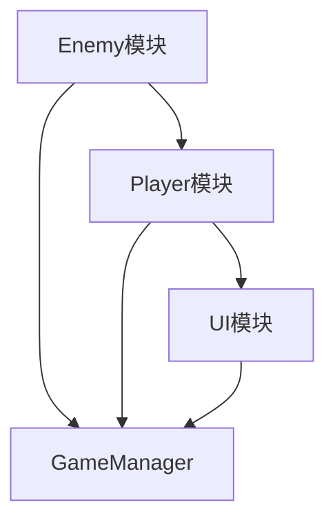

# 项目整体框架分析器

## 目的

通过系统分析现有代码库，建立完整的项目上下文（Context），包括：
- 项目整体架构概览
- 各模块核心功能定义
- 模块间依赖关系图谱
- 关键设计决策记录

沉淀的 Context 将作为后续需求开发的重要参考，确保 AI 在未知背景下也能准确理解项目结构。

## 使用场景

**首次使用场景（必须）**：
- 新项目首次接入 AI Coding 工作流
- 已有项目首次使用本 Skills 体系
- context/ 目录不存在或为空时

**定期更新场景（建议）**：
- 新增核心模块后
- 架构重大调整后
- 每迭代周期（2-4周）同步一次

**触发条件**：
- 需求开发流程中发现无可用 context
- 用户主动要求分析项目框架
- 检测到 context/ 目录缺失或过期

## 触发方式

```
@project-context-analyzer
项目路径: [可选，默认为当前工作区]
深度: [standard/deep，默认为standard]
```

简写触发：
```
@project-context-analyzer
```

## 完整工作流程

```
开始分析
    │
    v
阶段1: 项目结构扫描
    │
    v
阶段2: 模块识别与核心功能分析
    │
    v
阶段3: 依赖关系梳理
    │
    v
阶段4: 架构决策提取
    │
    v
阶段5: 生成 Context 文档
    │
    v
阶段6: 验证与确认
    │
    v
Context 沉淀完成
```

---

## 阶段1：项目结构扫描

**目标**：全面了解项目物理结构和组织方式。

**操作**：
1. 扫描项目根目录结构
2. 识别 Scripts/ 目录下的所有 C# 脚本
3. 识别关键配置文件（.asmdef、package.json等）
4. 识别场景文件和资源组织结构

**扫描范围**：
```
Assets/
├── Scripts/              # 核心脚本目录
│   ├── [模块A]/
│   ├── [模块B]/
│   └── ...
├── Prefabs/              # 预制体
├── Scenes/               # 场景
├── ScriptableObjects/    # 数据配置
└── ...
```

**输出格式**：
```markdown
## 项目结构概览

### 目录树
```
[精简目录树，只显示关键层级]
```

### 统计信息
- 总脚本数: [X]个
- 总代码行数: [X]行
- 模块数: [X]个
- 场景数: [X]个
```

**确认点**：用户确认扫描范围是否完整。

---

## 阶段2：模块识别与核心功能分析

**目标**：识别项目中的功能模块，分析每个模块的核心职责。

**操作**：
1. 基于目录结构和命名空间识别模块边界
2. 分析每个模块的核心类
3. 提取模块的公共接口（public方法/属性）
4. 识别模块的主要职责和功能

**模块识别规则**：

| 识别方式 | 说明 | 示例 |
|---------|------|------|
| 目录结构 | Scripts/ 下的子目录 | Scripts/Player/ → Player模块 |
| 命名空间 | namespace 声明 | namespace Game.Player → Player模块 |
| 类型后缀 | Manager/Controller/Service | GameManager → 游戏管理模块 |
| 功能聚类 | 相关功能的脚本集合 | 所有UI相关脚本 → UI模块 |

**输出格式**：
```markdown
## 模块分析

### [模块名]

**定位**: [一句话描述模块职责]

**核心类**:
| 类名 | 类型 | 职责 |
|-----|------|------|
| [类名] | Manager/Controller/Service | [职责] |

**公共接口**:
```csharp
// 关键公共方法
public void [方法名]([参数]); // [用途]
public [类型] [属性名] { get; set; } // [用途]
```

**功能清单**:
- [ ] [功能1]
- [ ] [功能2]
- [ ] [功能3]

**复杂度评估**: [高/中/低]
- 脚本数: [X]个
- 代码行数: [X]行
- 依赖模块数: [X]个
```

**确认点**：用户确认模块划分是否合理。

---

## 阶段3：依赖关系梳理

**目标**：分析模块间的依赖关系，绘制依赖图谱。

**操作**：
1. 分析 using 语句和类型引用
2. 识别模块间的调用关系
3. 识别事件/委托的订阅关系
4. 绘制依赖图（文本形式）

**依赖类型识别**：

| 依赖类型 | 识别方式 | 示例 |
|---------|---------|------|
| 直接引用 | using 语句 | using Game.Player; |
| 类型依赖 | 字段/参数类型 | public PlayerController player; |
| 事件订阅 | += 操作符 | player.OnDeath += HandleDeath; |
| 资源依赖 | 预制体引用 | [SerializeField] GameObject uiPrefab; |
| 数据依赖 | ScriptableObject | public ItemData itemData; |

**输出格式**：
```markdown
## 依赖关系分析

### 模块依赖矩阵

| 模块 | Player | Enemy | UI | GameManager | ... |
|------|--------|-------|-----|-------------|-----|
| Player | - | ❌ | ✅调用 | ✅事件 | ... |
| Enemy | ✅检测 | - | ❌ | ✅事件 | ... |
| UI | ✅监听 | ❌ | - | ✅调用 | ... |
| ... | ... | ... | ... | ... | ... |

图例: ✅=有依赖, ❌=无依赖, ↺=循环依赖

### 关键依赖链

```
[模块A] → [模块B] → [模块C]
  ↓
[模块D]
```

**核心依赖**: [最重要的3-5条依赖链]

### 依赖风险点

| 风险 | 说明 | 建议 |
|-----|------|------|
| [风险1] | [描述] | [建议] |

### 依赖图（Mermaid）


```

**确认点**：用户确认依赖关系是否准确。

---

## 阶段4：架构决策提取

**目标**：识别和记录项目中的关键架构决策。

**操作**：
1. 识别使用的设计模式
2. 识别架构风格（MVC、ECS、组件化等）
3. 记录关键的技术选型
4. 识别编码规范和约定

**检查清单**：

| 检查项 | 发现内容 | 位置 |
|--------|---------|------|
| 设计模式 | [使用的模式列表] | [相关文件] |
| 架构风格 | [MVC/ECS/组件化] | [整体体现] |
| 单例使用 | [哪些Manager是单例] | [文件列表] |
| 事件系统 | [使用UnityEvents/自定义] | [相关文件] |
| 数据配置 | [SO/JSON/其他] | [配置目录] |
| 资源管理 | [Resources/Addressables/AssetBundle] | [加载代码] |
| 输入处理 | [InputManager/InputSystem] | [输入相关] |

**输出格式**：
```markdown
## 架构决策记录

### 设计模式应用

| 模式 | 应用场景 | 实现文件 | 评估 |
|------|---------|---------|------|
| [单例模式] | [GameManager等] | [文件路径] | [合适/需改进] |
| [观察者模式] | [事件系统] | [文件路径] | [合适/需改进] |

### 架构风格

**当前风格**: [风格名称]

**说明**: [架构风格描述]

**优点**:
- [优点1]
- [优点2]

**局限性**:
- [局限1]
- [局限2]

### 关键技术选型

| 技术领域 | 选型方案 | 版本/配置 | 说明 |
|---------|---------|----------|------|
| 输入系统 | [Input System/旧版] | [版本] | [说明] |
| 渲染管线 | [URP/Built-in] | [版本] | [说明] |
| 物理系统 | [2D/3D/自定义] | [设置] | [说明] |
| UI系统 | [uGUI/UI Toolkit] | [版本] | [说明] |
| 数据持久化 | [PlayerPrefs/JSON/数据库] | [方案] | [说明] |

### 编码规范

**命名约定**:
- 类名: [PascalCase]
- 方法名: [PascalCase/camelCase]
- 私有字段: [_camelCase/m_prefix]

**代码组织**:
- [规范1]
- [规范2]
```

**确认点**：用户确认架构决策记录是否准确完整。

---

## 阶段5：生成 Context 文档

**目标**：将所有分析结果沉淀为标准格式的 Context 文档。

**操作**：
1. 创建 context/ 目录结构
2. 生成 index.md 索引文件
3. 为每个模块生成独立文档
4. 生成架构和依赖文档

**目录结构**：
```
context/                              # 项目上下文根目录
├── index.md                         # 主索引文件
├── overview.md                      # 项目整体概览
├── architecture/                    # 架构文档
│   ├── dependency-graph.md         # 依赖关系图谱
│   └── decisions.md                # 架构决策记录
└── modules/                         # 模块详情
    ├── [模块A].md                  # 模块A详情
    ├── [模块B].md                  # 模块B详情
    └── ...
```

### index.md 模板

```markdown
# [项目名称] Context

**生成日期**: [YYYY-MM-DD]
**版本**: [版本号]
**分析工具**: project-context-analyzer

## 快速导航

### 整体概览
- [项目概览](./overview.md) - 项目整体架构和统计信息
- [依赖图谱](./architecture/dependency-graph.md) - 模块依赖关系
- [架构决策](./architecture/decisions.md) - 关键架构决策记录

### 模块详情
| 模块 | 复杂度 | 依赖数 | 文档 |
|------|--------|--------|------|
| [模块A] | [高/中/低] | [X]个 | [链接](./modules/[模块A].md) |
| [模块B] | [高/中/低] | [X]个 | [链接](./modules/[模块B].md) |

## 关键信息

### 核心模块（按重要性排序）
1. [模块A] - [一句话职责]
2. [模块B] - [一句话职责]

### 高风险依赖
- [风险1]: [说明]
- [风险2]: [说明]

### 后续开发建议
- [建议1]
- [建议2]

---

*本 Context 由 project-context-analyzer 自动生成，建议定期更新*
```

### modules/[模块名].md 模板

```markdown
# [模块名] 模块

## 基本信息

**定位**: [一句话职责描述]
**复杂度**: [高/中/低]
**脚本数**: [X]个
**代码行数**: [X]行

## 核心类

### [类名]

**类型**: [Manager/Controller/Service/Component]
**职责**: [详细职责描述]

**公共接口**:
```csharp
public class [类名] : [基类]
{
    // 事件
    public event Action<[类型]> [事件名]; // [触发时机]
    
    // 属性
    public [类型] [属性名] { get; set; } // [说明]
    
    // 方法
    public void [方法名]([参数]); // [用途]
}
```

**依赖**:
- 依赖模块: [模块A], [模块B]
- 被依赖模块: [模块C]

## 功能清单

### 已实现功能
- [x] [功能1]
- [x] [功能2]

### 待实现功能（如有TODO注释）
- [ ] [功能3] // TODO: [注释内容]

## 使用示例

```csharp
// [使用场景描述]
[var] [实例] = [获取方式];
[实例].[方法]([参数]);
```

## 注意事项

- [注意点1]
- [注意点2]
```

**确认点**：用户确认生成的文档结构是否满足需求。

---

## 阶段6：验证与确认

**目标**：验证 Context 的完整性和准确性。

**操作**：
1. 检查所有模块都有对应文档
2. 检查所有链接都有效
3. 统计信息汇总
4. 生成更新日志

**输出格式**：
```markdown
## Context 生成报告

### 生成统计

| 项目 | 数量 | 状态 |
|------|------|------|
| 模块文档 | [X]个 | ✅ 已生成 |
| 架构文档 | [X]个 | ✅ 已生成 |
| 索引文件 | [X]个 | ✅ 已生成 |
| 总文档数 | [X]个 | ✅ 完成 |

### 文件清单

```
context/
├── index.md ✅
├── overview.md ✅
├── architecture/
│   ├── dependency-graph.md ✅
│   └── decisions.md ✅
└── modules/
    ├── [模块A].md ✅
    ├── [模块B].md ✅
    └── ... ✅
```

### 使用说明

**后续需求开发时复用 Context**：

1. AI 自动检查 `context/` 目录是否存在
2. 如存在，读取 `context/index.md` 获取项目概览
3. 根据需求涉及的功能，查阅对应模块文档
4. 在架构分析时参考 `architecture/decisions.md`

**Context 更新建议**：
- 新增核心模块后：重新运行本分析器
- 架构重大调整：更新 `architecture/` 目录
- 常规迭代：每2-4周同步一次

---

✅ **Context 沉淀完成！**

生成的文档已保存在 `context/` 目录，可在后续需求开发中直接引用。
```

---

## Context 复用规范

### 在需求开发流程中使用

当执行 `@requirement-workflow` 时，AI 应：

1. **检查 Context 存在性**
   ```
   检查 context/index.md 是否存在
   ├── 存在 → 继续步骤2
   └── 不存在 → 提示用户先运行 @project-context-analyzer
   ```

2. **读取 Context**
   - 读取 `context/index.md` 获取项目整体信息
   - 根据需求识别涉及的模块
   - 读取相关模块的详细文档

3. **在分析中引用 Context**
   - 架构分析时参考已有的架构决策
   - 影响面分析时参考模块依赖关系
   - 设计新功能时遵循现有规范

### Context 引用格式

```markdown
**基于 Context 的分析**:

根据 [context/modules/Player.md]，Player 模块的核心职责是...
现有依赖关系显示 [context/architecture/dependency-graph.md]...
应遵循的架构决策 [context/architecture/decisions.md]...
```

---

## 与其他 Skill 的关系

```
project-context-analyzer
    ├── 输出 → context/ 目录（被其他 Skill 读取）
    │
    ├── 被 requirement-workflow 调用（检查/沉淀）
    │       ├── 检查 context/ 是否存在
    │       ├── 不存在 → 提示用户调用本 Skill
    │       └── 存在 → 读取并引用
    │
    ├── 被 architecture-design-analyzer 引用
    │       └── 读取现有架构决策
    │
    └── 被 impact-scope-analyzer 引用
            └── 读取模块依赖关系
```

---

## 使用示例

### 首次分析项目

```
用户：@project-context-analyzer

AI：开始项目整体框架分析...

---

📋 阶段1：项目结构扫描

扫描到项目结构：
Assets/
├── Scripts/
│   ├── Player/          (12个脚本)
│   ├── Enemy/           (8个脚本)
│   ├── UI/              (15个脚本)
│   └── GameManager/     (5个脚本)
├── Prefabs/
└── Scenes/

统计：40个脚本，约8000行代码

请确认扫描范围是否完整？

用户：确认

---

📋 阶段2：模块识别

识别到以下模块：

1. Player模块 - 玩家角色控制
   - 核心类: PlayerController, PlayerHealth, PlayerInput
   - 复杂度: 高

2. Enemy模块 - 敌人AI系统
   - 核心类: EnemyController, EnemyAI, EnemySpawn
   - 复杂度: 中

3. UI模块 - 用户界面
   - 核心类: UIManager, HealthBar, InventoryUI
   - 复杂度: 中

4. GameManager模块 - 游戏状态管理
   - 核心类: GameManager, LevelManager, SaveManager
   - 复杂度: 高

请确认模块划分是否合理？

用户：确认，合理

---

📋 阶段3：依赖关系梳理

分析依赖关系...

关键发现：
- Player → GameManager（事件订阅）
- Enemy → Player（检测和攻击）
- UI → Player/GameManager（监听状态）
- 所有模块都依赖 GameManager

⚠️ 发现循环依赖风险：Enemy ↔ Player

请确认依赖关系是否准确？

用户：确认

---

[继续阶段4-6...]

---

✅ Context 沉淀完成！

已生成以下文档：
- context/index.md
- context/overview.md
- context/architecture/dependency-graph.md
- context/architecture/decisions.md
- context/modules/Player.md
- context/modules/Enemy.md
- context/modules/UI.md
- context/modules/GameManager.md

后续需求开发时将自动复用这些 Context。
```

---

## 注意事项

1. **Context 是活文档**：应随项目演进定期更新
2. **首次使用必须**：新项目必须先运行本 Skill 沉淀 Context
3. **不影响现有代码**：本 Skill 只读取分析，不修改任何代码
4. **大项目分模块**：超大项目可分批分析，再整合 Context
5. **敏感信息处理**：自动过滤硬编码的密钥、密码等敏感信息

---

## 版本信息

- **版本**: 1.0.0
- **创建日期**: 2026-04-01
- **适用场景**: Unity 2D/3D 项目框架分析
- **依赖**: 无（纯分析工具）
