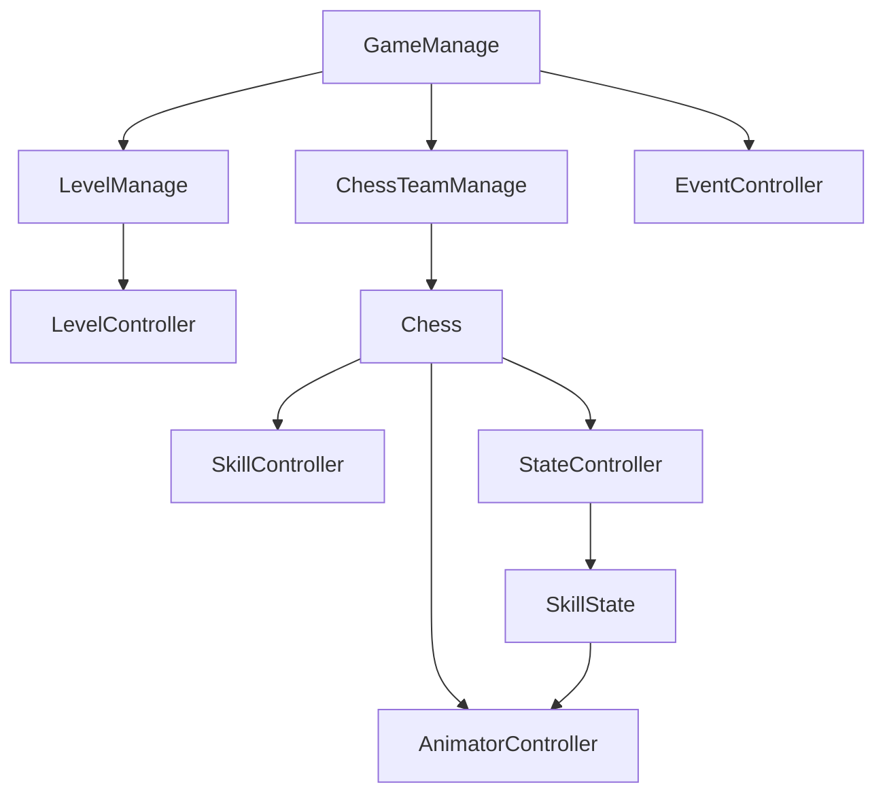

# 依赖关系图谱

## 模块依赖矩阵（逻辑层）

| 模块 | Manage | Chess | LevelSystem | Event | Buff | UI | Skill |
|------|:------:|:-----:|:-----------:|:-----:|:----:|:--:|:-----:|
| Manage | - | ✅创建/驱动 | ✅驱动 | ✅触发 | 部分 | ✅ | ❌ |
| Chess | ✅引用 | - | 局内交互 | ✅触发 | ✅拥有 | 间接 | ✅拥有 |
| LevelSystem | ✅依赖 | ✅生成棋子 | - | ✅触发 | ❌ | ✅ | ❌ |
| Event | 被订阅 | 被订阅 | 被订阅 | - | 少 | 被订阅 | 少 |
| Buff | Timer | ✅挂载 | ❌ | ❌ | - | ❌ | ❌ |
| UI | ✅入口 | ✅展示 | 部分 | ✅监听 | ❌ | - | ❌ |
| Skill | ❌ | ✅组件 | ❌ | 可选 | 可选 | ❌ | - |

图例: ✅ 有直接依赖或强耦合；❌ 无主要依赖。

## 关键依赖链

```
运行时主链:
GameManage → LevelManage → LevelController →（MapManage / ChessTeamManage）→ Chess

棋子:
ChessFactory / ChessTeamManage.CreateChess → Chess.InitChess → WhenChessEnterWar

技能动画:
StateController → SkillState.Enter → AnimatorController.PlaySkill
→（Animation Event）SkillController.UseSkill → ISkill.UseSkill

解耦:
任意 → EventController.TriggerEvent / AddListener → 订阅方
```

## Mermaid（简）



## 风险与建议

| 风险 | 说明 | 建议 |
|------|------|------|
| 单例枢纽 | 逻辑易从 `GameManage.instance` 辐射 | 新代码控制扇出；关键路径写清注释 |
| 事件字符串 | `EventName` 拼写错误运行时难查 | 统一枚举 ToString；订阅配对移除 |
| Skill 与动画 | `PlaySkill` 依赖 `SkillContext` 约定 | 键名集中常量类；文档化僵王等特例 |
