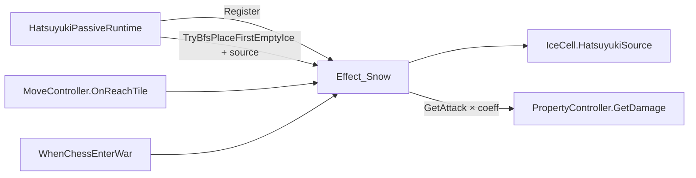

# 架构设计分析: 初雪冰道踩入伤害

**需求 ID**: ICE-HATSUYUKI-001  
**分析日期**: 2026-07-06  
**复杂度**: L1

## 1. 系统定位

| 项 | 结论 |
|----|------|
| 所属模块 | Effect（`Effect_Snow` 中枢）+ Map（`IceCell` 状态）+ Skill（初雪被动） |
| 上游依赖 | `GameManage` / `ChessTeamManage`、`EventController`、`MoveController`、`PropertyController` |
| 下游影响 | 初雪战斗体验；不影响冰车、开局雪、融化、种植阻挡 |
| 横向关联 | `TileEffect_WineZone`（进区 Buff）、`Fetter.RainDamage`（周期伤害，模式不同） |

## 2. 设计决策（定稿）

### 选用方案：Effect_Snow 集中监听 + IceCell 来源标记

| 方案 | 优点 | 缺点 | 结论 |
|------|------|------|------|
| **A. OnReachTile + WhenChessEnterWar**（选用） | 与格子 `mapPos` 一致；项目内已有先例 | 需集中管理监听生命周期 | ✅ |
| B. IceCell Trigger | 无需挂全场监听 | 预制体/层配置；与 `fireCollider` 职责交叉 | ❌ |
| C. Effect_Snow 周期轮询 | 实现简单 | 与「进格一次」语义不符；浪费 CPU | ❌ |

### 模式
- **观察者**：`WhenChessEnterWar` + `OnReachTile` 驱动结算。
- **数据标记**：`IceCell.HatsuyukiSource` 标识「初雪冰」与伤害来源。
- **策略**：伤害目标由 `GetEnemyTeam(source.tag)` 决定，非固定 `Enemy` tag。

### 数据流

## 3. 影响面（架构视角）

### 修改文件
| 文件 | 改动性质 |
|------|----------|
| `Assets/Script/Effect/Effect_Snow.cs` | 核心：注册、结算、API 扩展 |
| `Assets/Script/Map/Ice/IceCell.cs` | 来源字段 |
| `Assets/Script/Skill/ISkillPassive/PassiveSkillEffect_Hatsuyuki.cs` | 铺冰参数、Register、系数 |

### 不改
- `IceCell` 融化/挡板逻辑
- `PassiveSkillEffect_IceTrail`、`GameStartPlugin_Snow`
- 新增 Boss 免疫工具类

### 扩展性
- P1 减速可在 `TryApplyHatsuyukiIceEnterDamage` 内追加 Buff，无需改监听架构。
- 其他角色专属冰可在 `IceCell` 扩展来源类型枚举（本需求仅用 `HatsuyukiSource`）。

## 4. 风险识别

| 风险 | 等级 | 缓解 |
|------|------|------|
| 监听泄漏 | 中 | `_hookedChess` + 最后一只初雪 Unregister + `ClearAllIce` |
| 与 ColdBuff 未来叠加 | 低 | P0 无减速；P1 使用独立 `buffName` |
| 存档/读档初雪在场 | 低 | Register 在 `Setup`；读档 `WhenChessEnterWar` 会补 hook |

## 5. 结论

技术可行，改动范围**小**，风险**低**。推荐按需求卡片 P0 实现。
