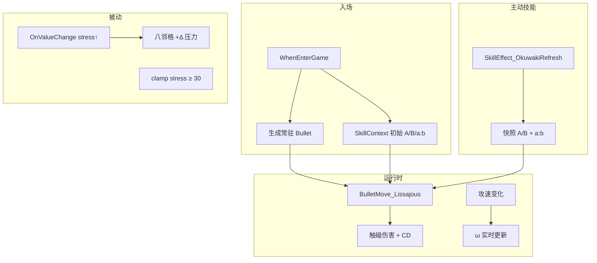

# 架构设计分析: 老仓育 — 欧拉公式常驻弹道

**需求 ID**: OKU-EULER-001  
**需求卡片**: `docs/requirements/老仓育-euler-attack.md`  
**分析日期**: 2026-07-09  
**复杂度**: L2

## 1. 系统定位

| 项 | 结论 |
|----|------|
| **所属模块** | Skill（被动/主动 ISkillEffect）+ Bullet（IBulletMove）+ Buff（压力）+ Map（行列/八邻格） |
| **上游依赖** | `GameManage` / `ChessTeamManage`、`MapManage`、`SkillContext`、`Buff_StressBuff_Death`、`ObjectPool` |
| **下游影响** | 老仓育战斗体验；与 GBC/学校关压力生态联动（八邻格含敌方） |
| **横向关联** | `SkillEffect_Tomo`（压力施加）、`PassiveSkill_Bungee`（九宫格枚举）、`ShootBullet`（弹道生成模式） |



## 2. 设计决策（定稿）

### 2.1 选用方案：SkillContext 快照 + IBulletMove 策略 + 专用 Bullet 子类

| 方案 | 优点 | 缺点 | 结论 |
|------|------|------|------|
| **A. SkillContext + BulletMove_Lissajous + Bullet_OkuwakiOrbit**（选用） | 符合项目 Bullet/ISkillEffect 惯例；参数快照与 ω 分离清晰 | 需新 Bullet 子类处理常驻多段命中 | ✅ |
| B. 重写 BulletMoveCurve + AnimationCurve | 复用类名 | Curve 语义不符李萨如；空壳易混淆 | ❌ |
| C. 纯 ISkillEffect 协程驱动 Transform（无 Bullet） | 少一层 | 脱离现有伤害/碰撞链；与 Weapon 体系割裂 | ❌ |
| D. 每帧 Grid 扫描代替弹道碰撞 | 判定稳定 | 失去「可见公式点」；性能随地图增大 | ❌ |

### 2.2 模式

- **策略模式**：`IBulletMove_Lissajous` 负责轨迹；参数从 `shooter.skillController.context` 读取。
- **快照模式**：A/B/a/b 写入 Context，仅在种下与主动技能时更新；ω 每帧读攻速。
- **观察者模式**：被动监听 `SkillContext.OnValueChange` 检测压力增量并扩散。
- **守卫模式**：`_isApplyingSpread` 标志位，扩散期间不再触发老仓被动，防递归。

### 2.3 核心组件划分

| 组件 | 职责 |
|------|------|
| `OkuwakiGridHelper` | 行/列友方计数；八邻格 Tile；`stress:30` → 最简 (a,b) |
| `BulletMove_Lissajous` | `x=A·sin(a·t+φ)`, `y=B·sin(b·t)`，中心=老仓格心 |
| `Bullet_OkuwakiOrbit` | `MaxHitNum` 极大；不命中回收；委托 `IBulletEffect` 做 per-target CD |
| `BulletEffect_OkuwakiTouchCd` | `Dictionary<Chess,float>` 触碰间隔 |
| `PassiveSkillEffect_Okuwaki` | 入场挂压力 Buff、spawn 弹道、监听 stress 扩散、下限 30 |
| `SkillEffect_OkuwakiRefresh` | 主动：重算 A/B 与 a:b，写 Context |
| `Buff_StressBuff_Okuwaki` | 继承 `Buff_StressBuff_Death`；`BuffReset` 后 clamp ≥30 |
| `OkuwakiOrbitAttack` | `IAttackFunction` 空实现或仅驱动动画（伤害由常驻弹承担） |

### 2.4 数据流

```text
种下:
  PassiveSkillEffect_Okuwaki.SkillEffect
    → AddBuff(压力)
    → context: A=1,B=1,a=1,b=1
    → ObjectPool.Create(bulletPrefab) → InitBullet → 常驻

每帧:
  BulletMove_Lissajous.MoveBullet
    → center = user.moveController.standTile 世界坐标
    → ω = omegaScale × user.propertyController.GetAttackSpeed()
    → A,B,a,b,φ from context

主动技能:
  SkillEffect_OkuwakiRefresh
    → A = CountFriendsInRow(user)
    → B = CountFriendsInCol(user)
    → (a,b) = ReduceRatio(stress, 30)
    → 写 context（不改 stress）

压力 +Δ:
  OnValueChange → if new>old && !_isApplyingSpread
    → foreach tile in Neighbor8(user):
         foreach chess on tile (chess != user):
           EnsureStressBuff + BuffReset(Δ)
```

### 2.5 a:b 公式（定稿）

```csharp
// stress:30 最简整数比
int g = Gcd(stress, 30);
int a = Clamp(stress / g, 1, ratioMax);
int b = Clamp(30 / g, 1, ratioMax);
```

### 2.6 扩展性

- 轨迹残影 / 公式 UI：在 `Bullet_OkuwakiOrbit` 或独立 `ISkillEffect` 读同一 Context，不耦合移动逻辑。
- 其他角色复用李萨如弹：抽离 `BulletMove_Lissajous` 为通用类，Context 键名参数化。

## 3. 影响面（架构视角）

### 3.1 新增文件（预估）

| 文件 | 说明 |
|------|------|
| `Assets/Script/bullet/IBulletMove/BulletMove_Lissajous.cs` | 李萨如移动 |
| `Assets/Script/bullet/Bullet_OkuwakiOrbit.cs` | 常驻弹子类 |
| `Assets/Script/bullet/IBulletEffect/BulletEffect_OkuwakiTouchCd.cs` | 触碰 CD |
| `Assets/Script/Skill/ISkillPassive/Story/PassiveSkillEffect_Okuwaki.cs` | 被动+ spawn |
| `Assets/Script/Skill/ISkillEffect_Plant/Story_Skill/SkillEffect_OkuwakiRefresh.cs` | 主动刷新 |
| `Assets/Script/Skill/ISkillPassive/Story/Buff_StressBuff_Okuwaki.cs` | 压力下限 |
| `Assets/Script/Skill/ISkillPassive/Story/OkuwakiGridHelper.cs` | 格子/比例工具 |
| `Assets/Script/Weapon/IAttackFunction/OkuwakiOrbitAttack.cs` | 空攻击占位 |

### 3.2 修改文件

| 文件 | 改动 |
|------|------|
| `Assets/Prefab/ChessPrefab/物语/老仓育/老仓育.prefab` | 武器、被动、主动、Bullet 引用 |
| `Assets/Resources/ChessData/Player/老仓育.asset` | 属性、技能配置 |

### 3.3 不改

- `Bullet.cs` 基类逻辑
- `Buff_StressBuff_Death` 全局行为（仅子类化老仓专用）
- 其他棋子弹道

### 3.4 性能

| 项 | 评估 |
|----|------|
| CPU | 单颗弹 Update + Trigger；八邻格传导 O(8×棋子数)，非每帧 |
| 内存 | 1 Bullet/老仓 + 触碰 CD 字典（按命中敌数） |
| 关键路径 | 否（单角色） |

## 4. 风险识别

| 风险 | 等级 | 缓解 |
|------|------|------|
| 高速 ω 漏判 | 中 | `ωMax`；必要时子步或格点辅助采样 |
| 压力扩散误连锁 | 中 | `_isApplyingSpread` + 排除 self |
| 敌方获压力副作用未定义 | 低 | 与策划确认僵尸压力 UI/阈值；Tomo 式挂 Buff |
| 对象池回收泄漏 | 中 | `OnRemove` / `WhenLeaveLevel` 回收 Bullet |
| a:b 大数（如 stress=90→3:1）形状难读 | 低 | `ratioMax` clamp |

## 5. 实施步骤

1. `OkuwakiGridHelper` + 单元逻辑（行列计数、gcd 比例、八邻格）
2. `BulletMove_Lissajous` + `Bullet_OkuwakiOrbit` + TouchCd
3. `PassiveSkillEffect_Okuwaki`（spawn + 压力 Buff + 扩散）
4. `SkillEffect_OkuwakiRefresh`
5. Prefab / Asset 配置与关卡验证

## 6. 结论

技术可行，改动范围**中**，以**新增文件为主**，对现有系统**无破坏性修改**。推荐按需求卡片 P0 实施。
