# 生存模式 · 无尽出怪逻辑（详解）

> **资料来源**：B 站 UP 主 [spc-ALLEN](https://www.bilibili.com/) 对《植物大战僵尸》原版 PC **生存模式 · 无尽（Endless）** 内部出怪算法的逆向整理。  
> **本文性质**：设计参考文档，描述的是 **原版 PVZ1 无尽** 的行为，不是 AVZ 现有 `WaveData.InitWave` 的实现说明。  
> **图片存档**：`docs/game-design/images/endless-spawn/`（已从 QQ 缓存目录迁入项目，使用相对路径引用）。

---

## 目录

1. [核心概念与术语](#1-核心概念与术语)
2. [两层结构总览](#2-两层结构总览)
3. [阶段 A：选卡时生成本局僵尸池](#3-阶段-a选卡时生成本局僵尸池)
4. [阶段 B：一轮 20 波的波次结构](#4-阶段-b一轮-20-波的波次结构)
5. [阶段 C：单波内如何凑满 50 只怪](#5-阶段-c单波内如何凑满-50-只怪)
6. [阶段 D：出怪如何「饱和」](#6-阶段-d出怪如何饱和)
7. [重要里程碑速查表](#7-重要里程碑速查表)
8. [与 AVZ 现有系统的差异（仅供后续讨论）](#8-与-avz-现有系统的差异仅供后续讨论)
9. [附图索引](#9-附图索引)

---

## 1. 核心概念与术语

| 术语 | 含义 |
|------|------|
| **选卡** | 每 **2 个旗帜（flag）** 之间的整段流程。玩家重新选植物，同时系统重新生成本段要用的**僵尸种类池**。一轮选卡包含 **20 个小波（wave）**。 |
| **flag（f）** | 旗帜波，即每 10 个小波出现一次的**大波**（w10、w20…）。无尽模式进度条上的「脑子」图标。 |
| **wave（w）** | 小波。一轮选卡内编号 w1～w20。 |
| **集合 A** | **备选僵尸池**：本场地图允许出现的僵尸 + **2 个占位僵尸**（引擎内部用，最终会删掉）。 |
| **集合 B** | **出场僵尸池**：本段 20 波实际会参与抽选的僵尸种类。 |
| **级别** | 每种僵尸有一个整数 **级别（Level）**，表示「占用的难度点数」。单只僵尸级别越高，越占本波预算。最高级别为 **10**（白眼、红眼）。 |
| **权重** | 在集合 B 已确定后，单波内用 **加权随机** 决定「下一只出哪种」。权重越大，越容易被抽到。 |
| **级别上限** | 每一小波有一个 **级别总和上限**。若已抽中的僵尸级别之和达到上限，本波**提前结束**，实际出怪数可能 **< 50**。 |
| **阶数** | 僵尸按强度分为 **四阶**，高阶僵尸有「最早可出现在第几波」的门禁，随无尽进度逐渐提前。 |
| **饱和** | 当级别上限足够高、基础僵尸权重足够低时，每波都能稳定出满 **50 只**，且高威胁僵尸（尤其红眼）出现频率达到上限。 |

**换算关系**：

```
1 次选卡 = 20 个小波 = 2 个 flag
第 n 次选卡 ≈ 第 (2n-1)～2n 个 flag
例：第 63 次选卡 ≈ 第 125～126 flag
```

---

## 2. 两层结构总览

无尽出怪不是「每波独立随机一张僵尸表」，而是 **先定种类池，再按波次预算抽数量**：

```text
┌─────────────────────────────────────────────────────────┐
│  选卡阶段（每 2 flag 一次）                                │
│  输入：场地类型 + 当前是第几次选卡                          │
│  输出：集合 B = 本段 20 波可用的僵尸「种类列表」              │
└──────────────────────────┬──────────────────────────────┘
                           │
                           ▼
┌─────────────────────────────────────────────────────────┐
│  单波生成（w1～w20，每波目标 50 只）                        │
│  1. 根据 flag/选卡序号 计算本波「级别上限」                  │
│  2. 按门禁筛出本波允许出现的种类                            │
│  3. 加权随机逐只抽取，直到满 50 只或触达级别上限              │
│  4. 旗舰波（w10/w20）有固定前缀（8 普僵 + 1 旗帜）           │
└─────────────────────────────────────────────────────────┘
```

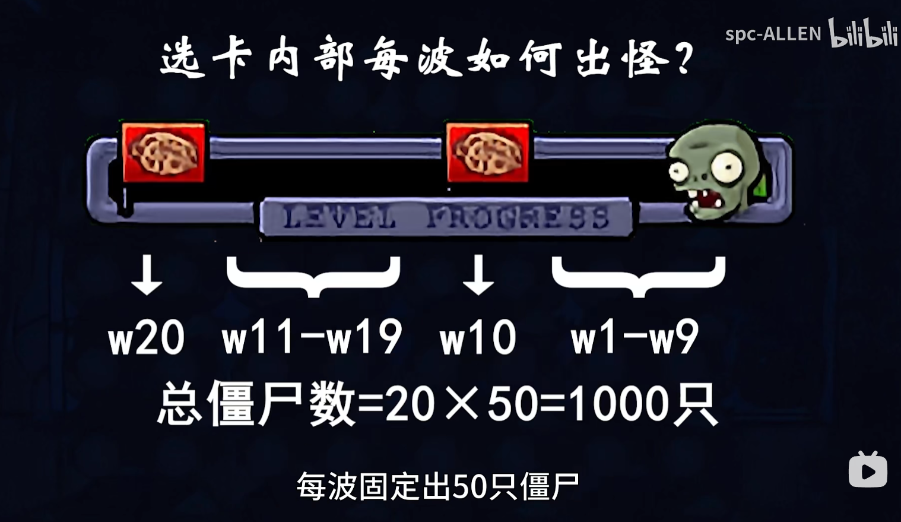

---

## 3. 阶段 A：选卡时生成本局僵尸池

### 3.1 场地决定「集合 A」里有哪些僵尸

集合 A 的元素 = **该场地可出的僵尸** + **2 个占位僵尸**。


#### 任何场地都会出现的 15 种（通用池）

普僵、路障、铁桶、撑杆、读报、铁门、橄榄、小丑、气球、跳跳、蹦极、扶梯、投篮、红眼、白眼。


#### 场地专属与排除规则

| 规则 | 说明 |
|------|------|
| **NE 以外的场地** | 可出 **冰车** |
| **NE 场地** | **不出冰车** |
| **泳池场地** | 额外可出 **潜水、海豚** |
| **屋顶以外的场地** | （配合其他规则使用） |
| **屋顶场地** | **不出舞王、矿工** |


---

### 3.2 第一次选卡：特殊规则（新手保护）

**第一次选卡不跑完整随机流程**，僵尸种类固定为：

> **普僵、路障、铁桶**（3 种）

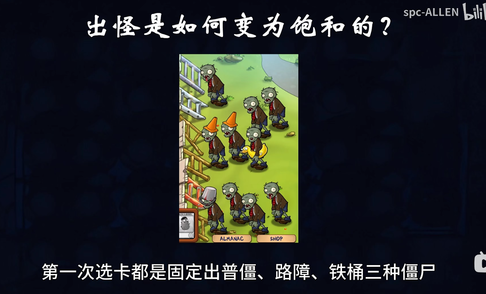

---

### 3.3 第二次及以后选卡：六步算法

从第二次选卡开始，用 **集合 A → 集合 B** 的六步流程生成本段僵尸池。

#### 第一步：初始化

- **集合 A** = 本场可出僵尸 + 2 个占位僵尸  
- **集合 B** = 空  


**泳池场地示例（第二步结束时）**：

| 集合 | 内容 |
|------|------|
| A（21 种 + 占位） | 路障、铁桶、撑杆、读报、铁门、橄榄、舞王、潜水、冰车、海豚、小丑、气球、矿工、跳跳、蹦极、扶梯、投篮、红眼、白眼、占位1、占位2 |
| B | 普僵 |

#### 第二步：普僵必进 B

将 **普僵** 从 A 移入 B（**100% 出现**）。

#### 第三步：路障 / 读报二选一

- **80%**：将 **路障** 移入 B  
- **20%**：将 **读报** 移入 B  

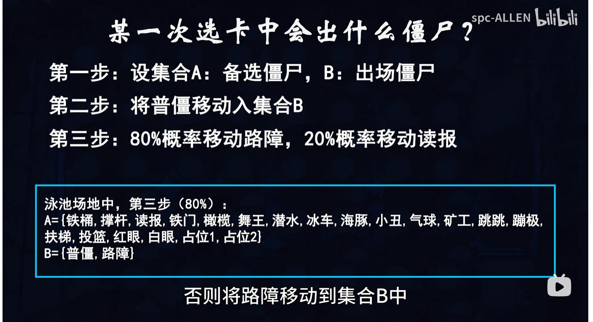

**泳池示例（第三步后，假设随到路障）**：

| 集合 | 内容 |
|------|------|
| A | 铁桶、撑杆、读报、铁门、橄榄、舞王、潜水、冰车、海豚、小丑、气球、矿工、跳跳、蹦极、扶梯、投篮、红眼、白眼、占位1、占位2 |
| B | 普僵、路障 |

#### 第四步：从 A 剩余中随机抽取若干种

从 A 中**剩余僵尸**里 **随机、不重复** 地选取若干种移入 B。

- **第二次选卡**：抽取 **2 种** → 本段合计约 **2～4 种**（含前面固定进的普僵 / 路障或读报）  
- **第三次选卡起**：每次抽取数量 **+1**  
- **第九次选卡及以后**：固定从 A 抽 **9 种** → 本段合计约 **9～11 种**（含占位时上限更高，删占位后略少）  

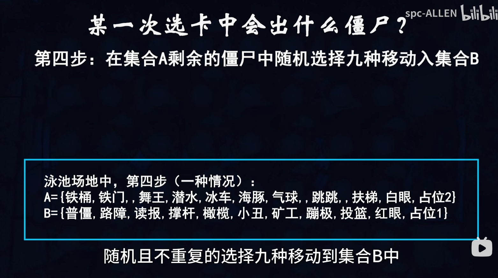

**泳池示例（第四步后）**：

| 集合 | 内容 |
|------|------|
| A | 铁桶、铁门、舞王、潜水、冰车、海豚、气球、跳跳、扶梯、白眼、占位2 |
| B | 普僵、路障、读报、撑杆、橄榄、小丑、矿工、蹦极、投篮、红眼、占位1 |

#### 第五步：删除占位僵尸

将 B 中所有 **占位僵尸** 删除。  
此时 B 的元素个数 = **本段实际可用的僵尸种类数**。

#### 第六步：加入旗帜与雪人

向 B 中加入：

- **旗帜僵尸**（用于旗舰波）  
- **雪人僵尸**（极低权重稀有怪，见下文权重表）  

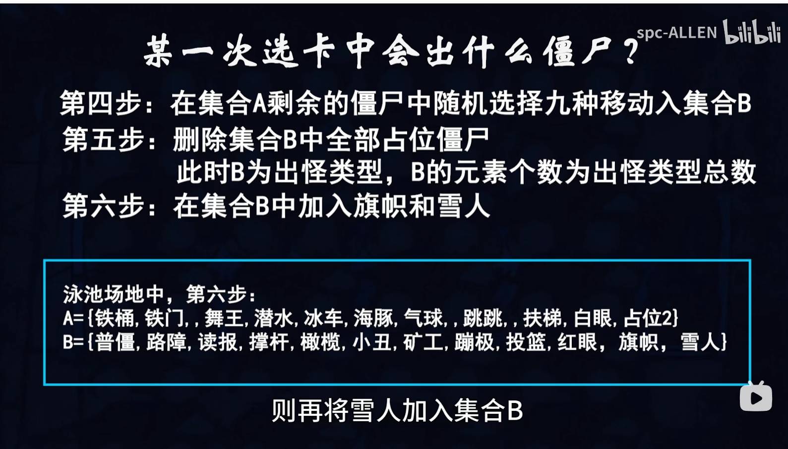

**泳池示例（第六步完成后）**：

| 集合 B（最终） |
|----------------|
| 普僵、路障、读报、撑杆、橄榄、小丑、矿工、蹦极、投篮、红眼、**旗帜**、**雪人** |

---

### 3.4 选卡阶段「种类数」随进度增长

| 选卡次数 | 本段僵尸种类数（约） |
|----------|---------------------|
| 第 1 次 | 固定 3 种（普僵、路障、铁桶） |
| 第 2 次 | 2～4 种 |
| 第 3 次 | 比上次 +1 种 |
| … | 每次 +1 |
| 第 9 次及以后 | 稳定在 **9～11 种** |

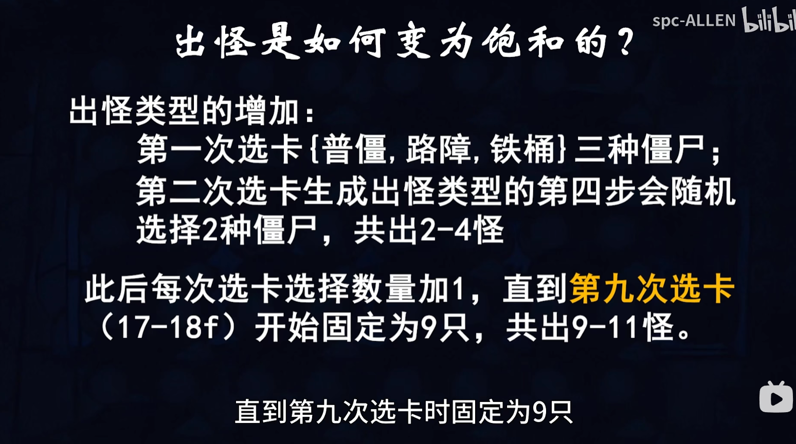

> **设计含义**：无尽开局种类少、压力可控；越往后同一局内僵尸种类越多，玩家必须泛解阵容。

---

## 4. 阶段 B：一轮 20 波的波次结构

每完成一次选卡，接下来固定打 **20 个小波**：

```text
w1 → w2 → … → w9 → [w10 旗舰波] → w11 → … → w19 → [w20 旗舰波]
         第 1 个 flag                    第 2 个 flag（本段结束，进入下次选卡）
```

- **每波目标出怪数**：**50 只**  
- **一轮选卡总出怪数**：`20 × 50 = 1000 只`  


---

## 5. 阶段 C：单波内如何凑满 50 只怪

### 5.1 旗舰波（w10、w20）的固定前缀

**旗舰波**先生成固定组合，再随机填满剩余名额：

1. **固定**：8 只普僵 + 1 只旗帜僵尸  
2. **随机**：再从集合 B 中加权随机抽取 **剩余 41 只**  

合计：`8 + 1 + 41 = 50`

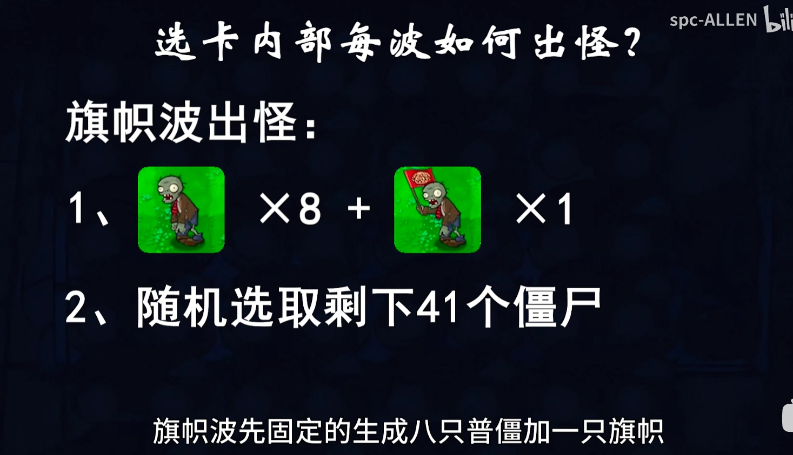

普通小波（非 w10/w20）则没有这 9 只固定前缀，50 只全部走加权随机（仍受级别上限约束）。

---

### 5.2 加权随机：逐只抽取

对集合 B 中**本波允许出现**的僵尸种类：

- 每种僵尸有权重 `a`  
- 所有候选权重之和为 `b`  
- 单次抽中概率 = `a / b`  
- 重复抽取，直到满 50 只或触达级别上限  

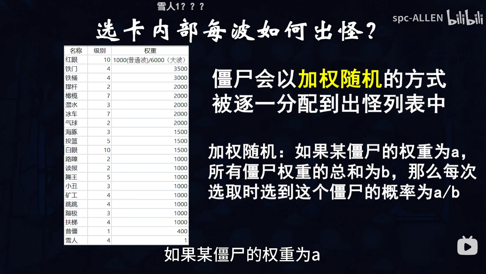

#### 完整权重与级别表

| 名称 | 级别 | 权重（普通波） | 备注 |
|------|------|----------------|------|
| 红眼（Giga） | 10 | 1000 | 大波时权重 **6000** |
| 铁门 | 4 | 3500 | |
| 铁桶 | 4 | 3000 | |
| 撑杆 | 2 | 2000 | |
| 橄榄 | 7 | 2000 | |
| 潜水 | 3 | 2000 | |
| 冰车 | 7 | 2000 | |
| 气球 | 2 | 2000 | |
| 海豚 | 3 | 1500 | |
| 投篮 | 5 | 1500 | |
| 白眼（Gargantuar） | 10 | 1500 | |
| 路障 | 2 | 1000 → 见 §6.3 | 随选卡衰减 |
| 读报 | 2 | 1000 | |
| 舞王 | 5 | 1000 | |
| 小丑 | 3 | 1000 | |
| 矿工 | 4 | 1000 | |
| 跳跳 | 4 | 1000 | |
| 蹦极 | 3 | 1000 | |
| 扶梯 | 4 | 1000 | |
| 普僵 | 1 | 400 → 见 §6.3 | 随选卡衰减 |
| 雪人 | 4 | **1** | 极低概率 |
| 旗帜 | — | （旗舰波固定出） | 不参与普通加权池 |

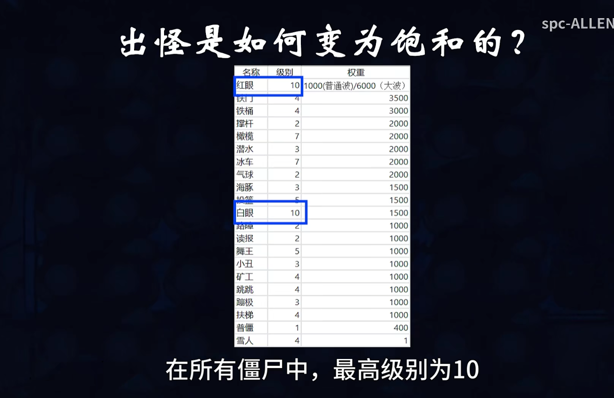

> **最高级别 = 10**。理论上一波 50 只全是 10 级僵尸时，级别总和 = `50 × 10 = 500`，这也是后面「级别饱和」的硬顶。

---

### 5.3 单波「级别上限」截断

每一小波在抽怪前有一个 **级别上限** `L_max`：

> 若当前已生成僵尸的 **级别总和** > `L_max`，则 **超出部分强制不出**，本波提前结束。  
> 因此实际出怪数可能 **小于 50**。

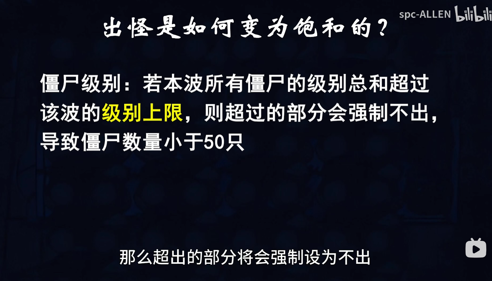

**早期无尽**：`L_max` 较低，高级僵尸占满预算后，波内总只数上不去 → **出不满 50 只**。  
**后期无尽**：`L_max` 升高、普僵/路障权重降低 → 逐渐能稳定 **50 只/波**。

---

### 5.4 单种类数量上限（以红眼为例）

部分僵尸在 **一轮选卡（20 波）** 内有 **种类级别的数量上限**：

**红眼（Giga）示例**：

- 在 w1～w12 的普通波中累计出现 **50 只** 后，w13～w19 的**普通波不再出红眼**  
- **w20 旗舰波**仍可出红眼（大波例外）  

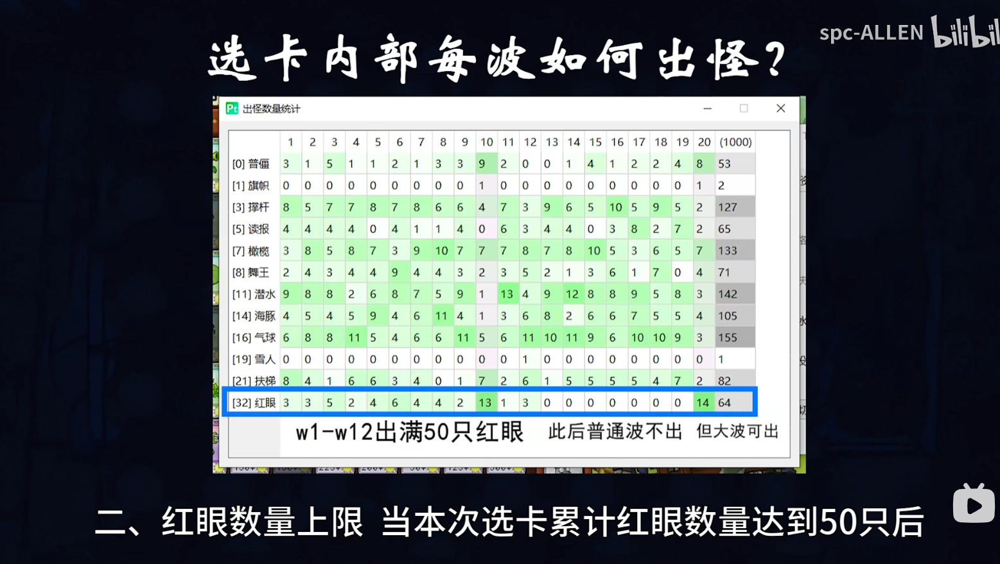

> 这防止单段内旗舰怪无限堆叠，同时保证最终大波仍有压力。

---

## 6. 阶段 D：出怪如何「饱和」

「饱和」在无尽模式里同时指三件事：

1. **种类饱和**：选卡生成的僵尸种类数达到 9～11 种上限  
2. **级别饱和**：每波级别上限 ≥ 500，能出满 50 只高威胁组合  
3. **权重饱和**：普僵/路障权重降到最低，红眼数量上限达到 50  


---

### 6.1 僵尸四阶分类

| 阶数 | 僵尸 |
|------|------|
| **一阶** | 普僵、路障、铁桶、读报、雪人 |
| **二阶** | 撑杆、铁门、橄榄、舞王 |
| **三阶** | 潜水、海豚、冰车、小丑、气球、矿工、跳跳、扶梯、投篮 |
| **四阶** | 白眼、红眼 |

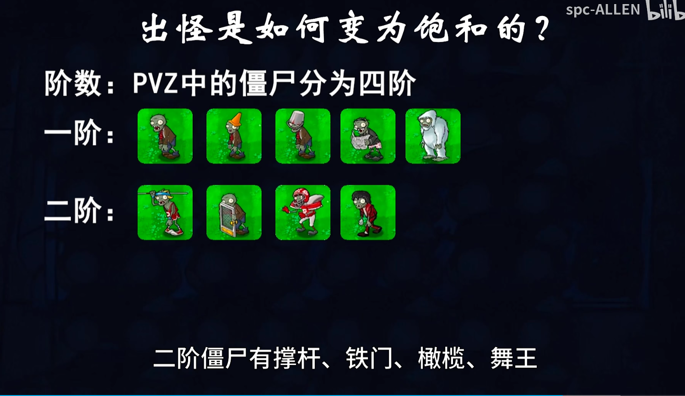

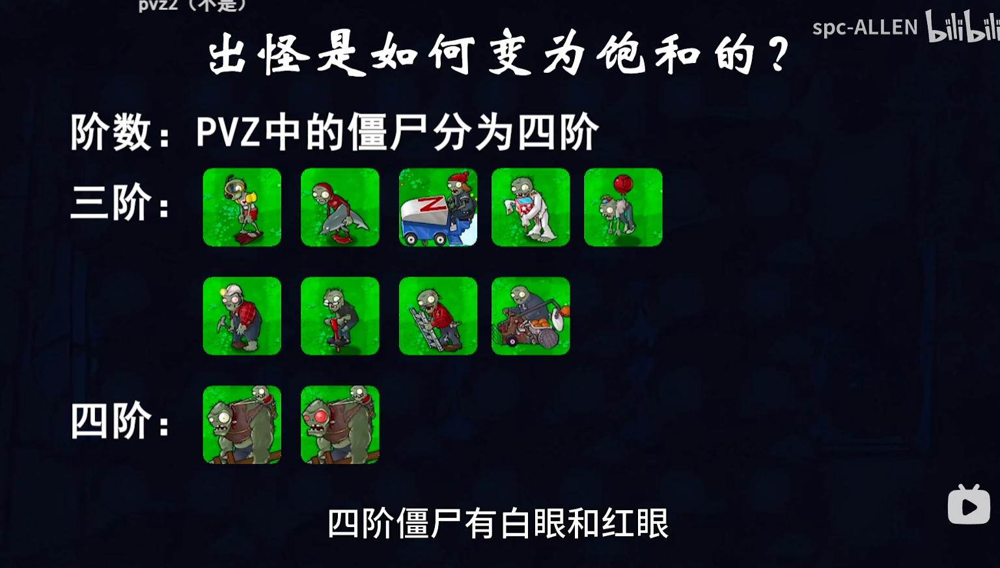

---

### 6.2 高阶僵尸的「最早出现波次」门禁

在 **前十次选卡** 内，各阶僵尸 **最早可出现的 wave** 基准为：

| 阶数 | 最早出现波次 |
|------|-------------|
| 一阶 | w1 |
| 二阶 | w5 |
| 三阶 | w10 |
| 四阶 | w15 |

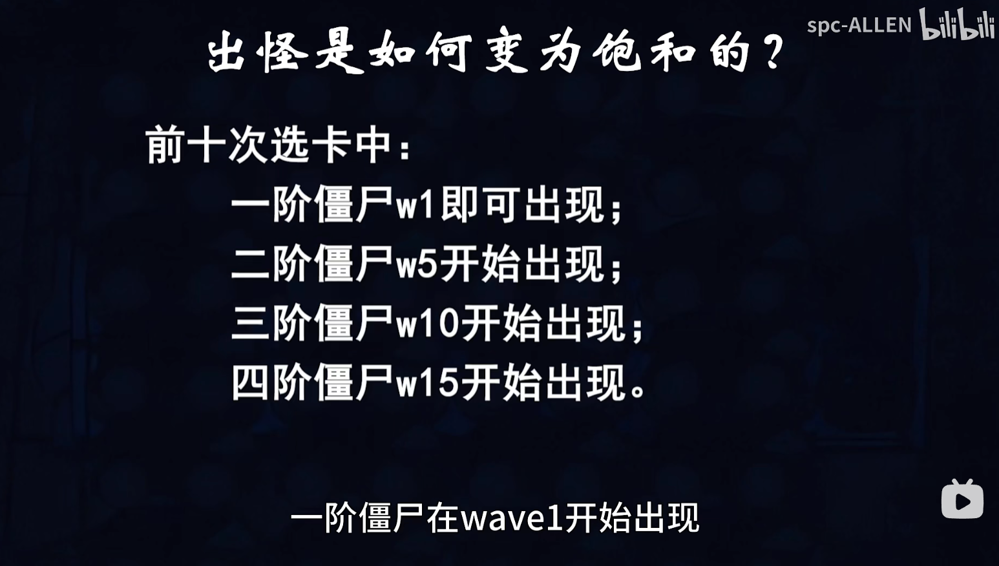

**第十一次选卡起**：二～四阶的「最早出现波次」在每次选卡时 **各减 1**（即高阶怪越来越早进场）。

- 到 **第 25 次选卡（约 49～50 flag）**：四阶（红眼/白眼）可在 **w1** 就出现。  

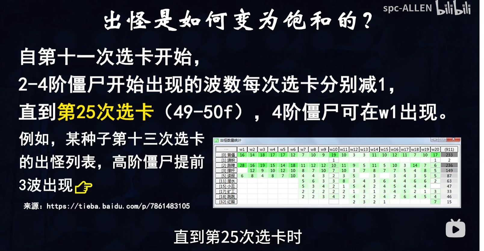

**例：第 13 次选卡** 的出怪统计中，红眼从 w12 才开始出现（比基准 w15 提前 3 波，因为 13 - 10 = 3）。

---

### 6.3 普僵 / 路障权重随选卡衰减

| 阶段 | 普僵权重 | 路障权重 |
|------|----------|----------|
| 前 5 次选卡 | 各 **4000**（固定） | 各 **4000** |
| 第 6 次选卡起 | 每次选卡 **-180** | 每次选卡 **-150** |
| 最终下限 | **400** | **1000** |

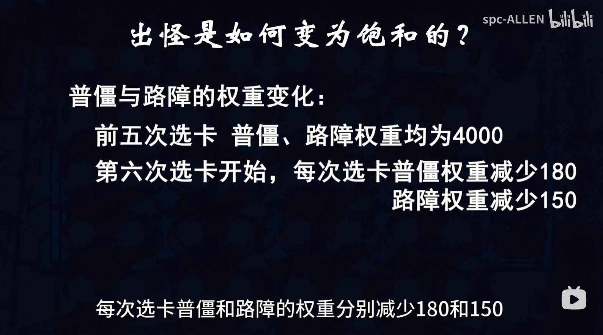

> 基础僵尸权重下降 → 加权随机更容易抽到高威胁僵尸 → 后期波次「含金量」上升。

---

### 6.4 每波「级别上限」的递增规则

#### 第一次选卡（n = 1）

- 开局级别上限 = **0**  
- 在以下波次**开始前**各 **+1**：w1、w4、w7、w11、w13、w16、w19  
- 第一次选卡期间合计 **+7** → 段末上限为 **7**

#### 第二次及以后选卡（n ≥ 2）

- **本次选卡开始时**的级别上限：`L_start = 8n - 9`  
  - 例：第 2 次选卡开始 = `8×2-9 = 7`（与第一次选卡结束衔接）  
- 在以下波次开始前各 **+1**：w1、w4、w6、w9、w11、w14、w16、w19  
- 每次选卡期间合计 **+8**

#### 旗舰波倍率

在 **旗帜波（w10 / w20）** 生成前，级别上限 **× 2.5**（以便塞入更多、更强的僵尸）。

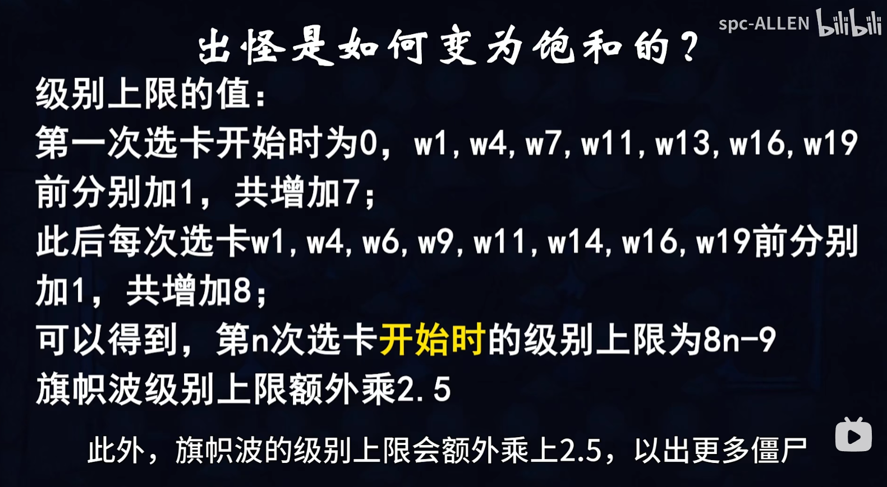

#### 级别饱和的数学终点

- 理论最大级别总和：`50 × 10 = 500`  
- 解 `7 + 8×(x-1) ≥ 500` → 约 **第 63 次选卡**（**125～126 flag**）起，级别上限可超过 500  

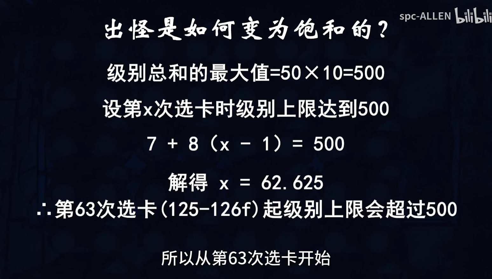

---

### 6.5 红眼（Giga）全局数量上限

| 选卡次数 | 红眼在一轮（20 波）内的数量上限 |
|----------|--------------------------------|
| 1～5 次 | **0**（不出红眼） |
| 第 6 次 | **1** |
| 第 7 次 | **2** |
| … | 每次选卡 **+1** |
| 第 55 次及以后（约 109～110 flag） | 固定 **50**（红眼数量饱和） |

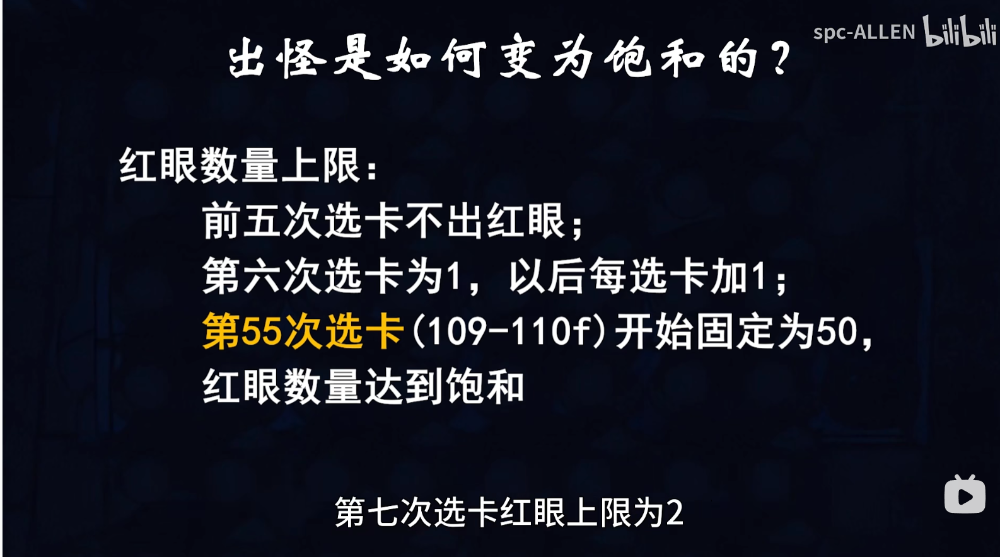

---

### 6.6 实测饱和 vs 理论饱和

| 指标 | 理论值 | 实测 / 实用值 |
|------|--------|---------------|
| 每波出满 50 只 | 第 **125 flag** 才能保证（极端情况） | **第 85 flag 起** 基本可保证每波 50 只 |
| 红眼数量饱和 | — | 约 **109 flag** |
| 级别上限超 500 | 第 **125～126 flag** | — |

> 125f 的「保证」在工程上意义不大：需要「几乎全是红眼」的概率 < 10⁻³⁰。  
> 设计无尽时，**85f / 109f / 125f** 均可视为「出怪饱和」相关节点，取决于你要对齐严格数学还是玩家体感。  
> 参考社区数据：[pvz.tools/wiki](https://pvz.tools/wiki/)

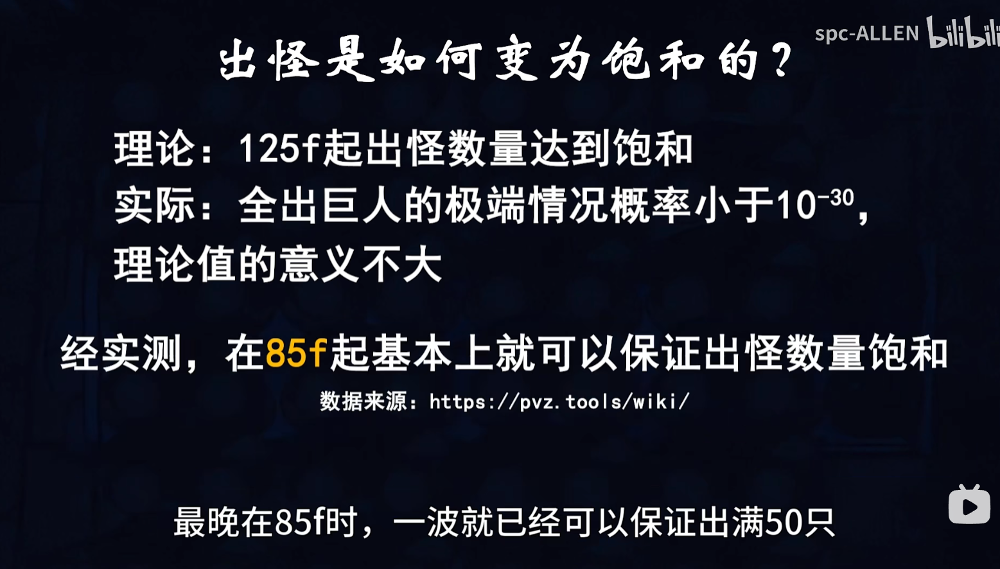

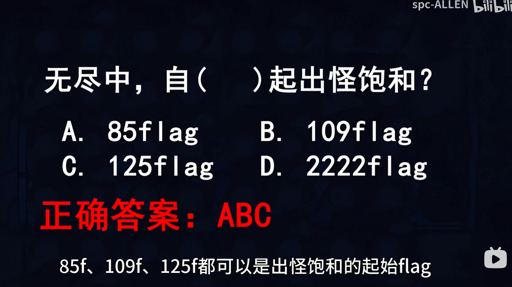

---

## 7. 重要里程碑速查表

| Flag | 发生了什么 |
|------|------------|
| **开局（第 1 次选卡）** | 只有普僵、路障、铁桶 3 种 |
| **11f** | 红眼开始出现；普僵/路障权重开始下降 |
| **17f** | 单段僵尸种类数达到 **9～11 种** |
| **49f** | 四阶可在 **w1** 出现；普僵/路障权重触底（400 / 1000） |
| **85f** | 实测：每波基本可出满 **50 只** |
| **109f** | 红眼单段数量上限达到 **50**（红眼饱和） |
| **125f** | 理论：级别上限保证可撑满 50×10 的极端组合 |

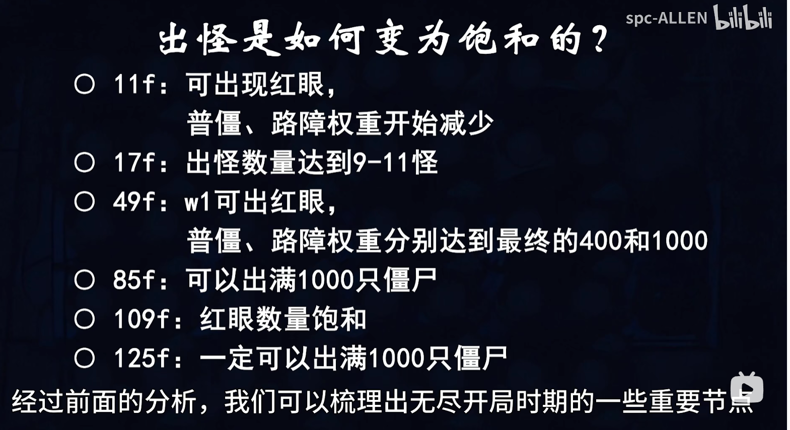

---

## 8. 与 AVZ 现有系统的差异（仅供后续讨论）

阅读完本文后，若要落地到 AVZ，需要先认清 **原版无尽** 与 **当前 `LevelController`** 的结构差异：

| 维度 | 原版无尽（本文） | AVZ 现状（`WaveData.InitWave`） |
|------|------------------|--------------------------------|
| 关卡长度 | 真正无尽，每 2 flag 重新选卡 | `LevelData.MaxWave` 固定，到顶结束 |
| 强度模型 | **级别上限** + **权重随机** + 每波 50 只 | **僵尸价值预算** `maxZombieValue` + 稀有度抽签 |
| 种类池 | 选卡时生成集合 B，20 波共用 | 每波 `InitWave` 重新筛池并分配数量 |
| 旗舰波 | w10/w20 固定 8 普僵 + 1 旗帜 | 每 10 波大波价值公式不同，无 8+1 前缀 |
| 进度参数 | 选卡序号 n、flag 数 | 仅 `currentWave`（0 起） |
| 场地 | A 池随地图变 | `LevelData` + 插件（雪、传送带等） |

**可能的实现路线**（后续商讨用，此处不定论）：

1. **近似复刻**：新增 `LevelController_Endless` + `EndlessWaveGenerator`，按本文六步生成选卡池，按权重/级别上限生成每波 50 只。  
2. **参数映射**：保留现有 `WaveData`，但把 `n/t/MaxWave` 改成随 flag 递增，用 `waveLimit` 模拟四阶门禁。  
3. **混合**：选卡池用原版逻辑，单波数量仍用 AVZ 价值预算（手感会不同）。

---

## 9. 附图索引

| 图 | 文件 | 内容 |
|----|------|------|
| 1 | `868a69f7....png` | 通用 15 种僵尸 |
| 2 | `0dbf22c3....png` | 场地差异规则 |
| 3 | `e8559d2f....png` | 选卡六步：第一步 + 泳池 A/B 示例 |
| 4 | `3e1ecdd9....png` | 第三步 80/20 路障读报 |
| 5 | `c3335c82....png` | 第四步随机抽 9 种 |
| 6 | `3c343984....png` | 集合 A 含占位 |
| 7 | `d40b3238....png` | 第五、六步：删占位 + 旗帜雪人 |
| 8 | `e0ad4551....png` | 20 波 / 每波 50 / 共 1000 |
| 9 | `6c2cb204....png` | 加权随机 + 权重表 |
| 10 | `979c2bc0....png` | 红眼单段上限 50 |
| 11 | `5649788c....png` | 旗舰波 8+1+41 |
| 12 | `d5f8ccd4....png` | 饱和起点 85/109/125 |
| 13 | `9a8aec6a....png` | 第一次选卡仅 3 种 |
| 14 | `6c751da3....png` | 种类数 2→9 增长 |
| 15 | `f0b63d76....png` | 普僵路障权重衰减 |
| 16 | `c0307db7....png` | 饱和 = 阶数 + 级别 |
| 17 | `9da1e1cd....png` | 一阶二阶 |
| 18 | `0bdb5606....png` | 三阶四阶 |
| 19 | `52efe861....png` | 前十次选卡阶数门禁 |
| 20 | `f2b24a7f....png` | 第十一次选卡起门禁 -1 |
| 21 | `75974c24....png` | 级别上限截断 |
| 22 | `be9da769....png` | 级别上限 8n-9 与旗舰 ×2.5 |
| 23 | `99d361cd....png` | 级别权重对照表 |
| 24 | `9694cc4c....png` | 第 63 次选卡超 500 |
| 25 | `0387e109....png` | 实测 85f 出满 50 |
| 26 | `1cbe24ef....png` | 红眼上限到 55 次选卡饱和 |
| 27 | `126e3bb5....png` | 里程碑总表 |

---

*文档版本：2026-05-20 · 整理自 `docs/game-design/无尽出怪逻辑.md` 原始图片笔记*
