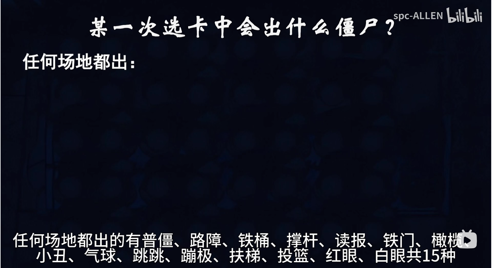
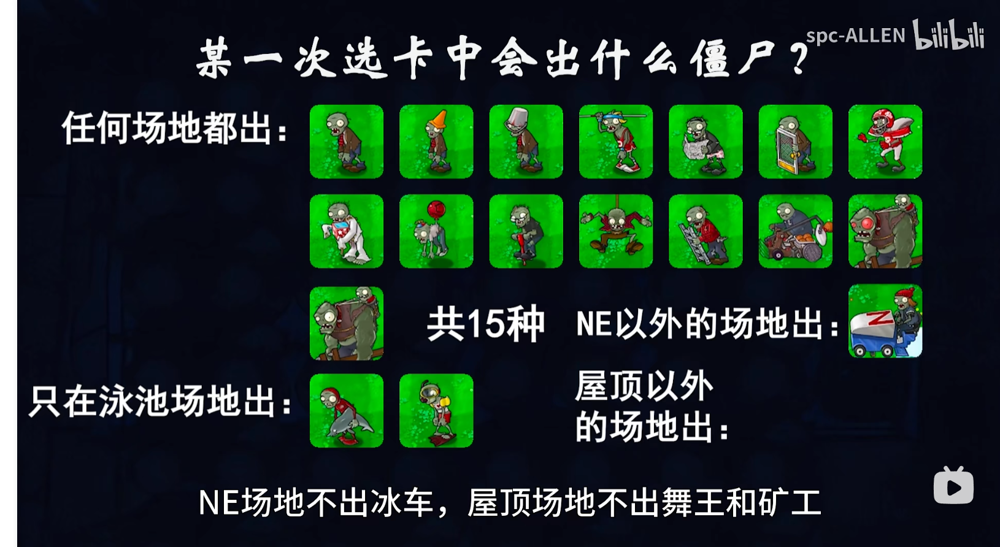
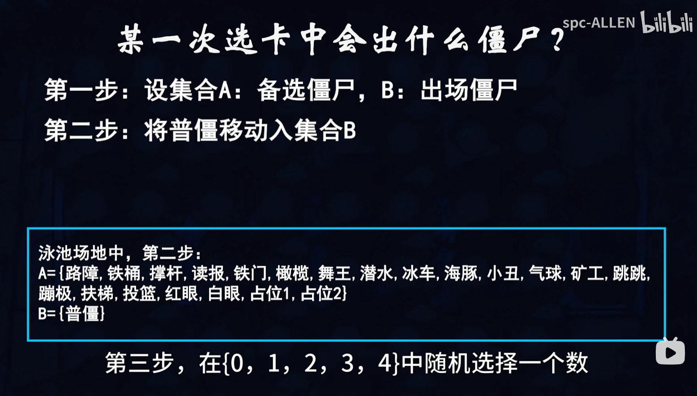

# 生存模式 · 无尽出怪逻辑（原始笔记）

> **已整理为可读详解版** → 请阅读 **[无尽出怪逻辑-详解.md](./无尽出怪逻辑-详解.md)**  
> 图片已迁入 `docs/game-design/images/endless-spawn/`，不再依赖本机 QQ 缓存路径。

---

生存模式，无尽

## 1. 出怪逻辑

完整文字说明、算法步骤、饱和公式与里程碑表见 **[无尽出怪逻辑-详解.md](./无尽出怪逻辑-详解.md)**。

### 附图（相对路径）

更多图片索引见详解文档第 9 节。
