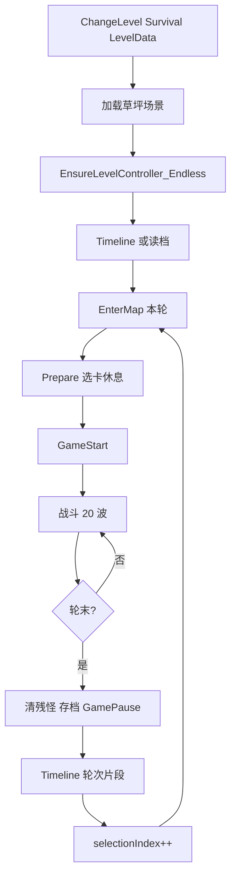
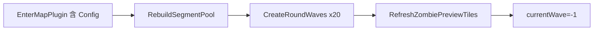

# 功能需求与设计文档：生存模式 · 无尽（Survival Endless）

## 基本信息

| 项 | 内容 |
|----|------|
| **功能名称** | 生存模式 · 无尽轮次循环 |
| **所属模块** | LevelSystem、Map、UI(PlantsShop/ProgressBar)、SaveSystem、Fetter（只读不改） |
| **需求类型** | **功能扩展**（在 `LevelController` / 插件 / Timeline 流程上扩展；`LevelMode.SurvivalMode` 已存在） |
| **优先级** | P0 可玩闭环；P1 羁绊槽位 / 完整饱和公式 |
| **预估复杂度** | A 级（跨 Controller、Timeline、存档、出怪） |
| **提出 / 定稿日期** | 2026-05-20 |
| **关联 Context** | [context/modules/LevelSystem.md](../../context/modules/LevelSystem.md)、[context/index.md](../../context/index.md) |
| **出怪参考** | [docs/game-design/无尽出怪逻辑-详解.md](../game-design/无尽出怪逻辑-详解.md)（原版 PVZ 行为，数值逐步对齐） |

---

## 一、需求摘要

在**同一场景、同一份 `LevelData`** 上，将游戏组织为 **「轮次（Round）」循环**：每一轮等价于一小关（默认 **20 波**），轮内预生成全部波次数据；轮间通过 **Timeline 休息段**（选卡/镜头）衔接，**场上植物与羁绊手牌核心不变**；全局可统计累计波次，无尽模式下永不触发通关。

**用户故事**：作为玩家，我希望在草坪上持续多轮防守，每轮僵尸种类与难度递进，轮间可休息选卡但不破坏已形成的羁绊阵容，以便体验接近原版生存的长期构筑乐趣。

---

## 二、现有业务分析（基于 Context）

### 2.1 模块现状

| 已有能力 | 说明 |
|----------|------|
| `LevelMode.SurvivalMode` | 枚举已有；`LevelData/SurvivalMode/` 目录待填资产 |
| `LevelController` + `WaveData` | 波次预算（`price`×25）、`rarity` 加权、`waveLimit` 筛池、每 10 波大波 |
| `ILevelPlugin` 三阶段 | EnterMap / PrePare / GameStart |
| `MapManage_PVZ` + Timeline | 信号调 `LevelController`；读档可跳过 Timeline |
| `SaveSystem` | `playerPlants`、`plantsShopData`、`LevelSaveData` |
| `FetterController.CheckFetter` | 读 `PlantsShop.currentShopIcons`，开局算一次即可（手牌不变则每轮相同） |

### 2.2 需求类型判定

**功能扩展**：不替换关卡内核，新增 `LevelController_Endless` 子类、轮次状态、Enter 插件配置，以及 Map 层 Timeline 转发。

### 2.3 与冒险模式的本质区别

| 维度 | 冒险关 | 无尽一轮 | 无尽全局 |
|------|--------|----------|----------|
| 场景 | 可换 | **同场景** | 同场景 |
| `MaxWave` | 5～40 | **20**（本轮 ProgressBar） | — |
| 胜负 | 通关 `GameOver(true)` | **轮次完成** → 下一轮 | `survivalMaxWave=-1` **永不通关** |
| 选卡 | 开局一次 | 每轮 Timeline Prepare（插件自判） | 羁绊 10 张锁定（P1） |
| 出怪池 | `zombieList` 每波 Init | **本轮 `segmentPool` 预生成 20 波** | 轮间饱和递进 |

---

## 三、核心设计概念

### 3.1 术语

| 术语 | AVZ 实现 |
|------|----------|
| **轮次（Round）** | `EndlessRunState.selectionIndex`（从 1 起） |
| **轮内波次** | `currentWave`：-1 → 0 … → 19（共 20 波） |
| **场地候选池（集合 A）** | `LevelData.zombieList`（不改结构） |
| **本轮出场池（集合 B）** | `EndlessRunState.segmentPool` |
| **累计通过波次** | `EndlessRunState.totalWavesCleared` |
| **全局通关上限** | `EnterMapPlugin_EndlessSpawnConfig.survivalMaxWave`（无尽为 **-1**） |

### 3.2 一轮 = 一小关

```text
轮次开始
  → EnterMap（本轮：种类池 + 预生成 N 波 + 预览僵尸）
  → GamePrepare（选卡休息，插件自判）
  → GameStart（开战，IfGameStart=true）
  → 战斗 N 波（ProgressBar 用 MaxWave=20）
  → 轮次结束（末波清场或超时；清残怪；存档；IfGameStart=false）
  → Timeline 从轮次片段播放 → 下一轮
```

**不触发**：`LeaveLevel`、`ChangeLevel`、通关 `outcome`（除非 `survivalMaxWave` 达标）。

---

## 四、架构设计

### 4.1 类与职责

```text
MapManage_PVZ
  EnsureLevelController()          // 按 levelMode AddComponent
  Timeline_EnterMap/Prepare/Start  // 转发 → currentController

LevelController_Endless : LevelController
  EnterMap()                       // 插件 + RunRoundEnter（不调用 base 整段）
  GameStart()                      // 首轮完整 / 后续轮无开局文案
  Update() / WaveCanAdvance()      // 末波 70s 上限、轮内 currentWave < MaxWave
  OnRoundComplete()                // 清怪、存档、暂停、播 Timeline
  CheckSurvivalWin()               // totalWavesCleared >= survivalMaxWave (>0)

EndlessRunState（纯数据，挂 Controller）
  selectionIndex, segmentPool, totalWavesCleared
  RebuildSegmentPool(...)
  GetEffectiveRarity(creator)      // 权重衰减，不改 PropertyCreator 资产

EnterMapPlugin_EndlessSpawnConfig : ILevelPlugin
  wavesPerRound, lastWaveHardLimit, survivalMaxWave
  权重衰减参数、首轮池规则等
  StadgeEffect → 写入 RunState / 触发 Rebuild

WaveData_Endless : WaveData
  InitWave → segmentPool + GetEffectiveRarity + 预算公式

LevelController（基类小改）
  protected virtual RefreshZombiePreviewTiles(IList<PropertyCreator> pool)
  // 默认 levelData.zombieList；无尽 override 用 segmentPool
```

**明确不做**：

- 独立 `EndlessSpawnConfig` ScriptableObject（配置进 Enter 插件）
- 独立 `EndlessSegmentPoolBuilder` 类（逻辑并入 `EndlessRunState`）
- 修改 `LevelData` 结构（仅多配插件条目）
- 为无尽单独复制场景（草坪 + 运行时 `AddComponent`）

### 4.2 Timeline 策略

**一条 Timeline**，不强制两条。

| 时机 | 播放方式 |
|------|----------|
| 首次进场景 | `time=0` 完整播（或 `playOnAwake`） |
| 第 2 轮起 | `dir.time = 轮次片段起点` 再 `Play()`（跳过开场长镜头） |

**跳过内容**（靠 Timeline 起点 + 插件自判，非第二套资源）：

- 开场剧情/长镜头
- `EnterWarPlugin_CarCreate` 等 `selectionIndex > 1` 不执行
- 第 2 轮起 `TextPanel.GameStart()` 文案

**保留**：

- 轮间相机移动（休息感）
- EnterMap / Prepare / Start 三个信号（改绑 **MapManage**）

### 4.3 MapManage 与 LevelManage 调用链（目标态）

```text
LevelManage.ChangeLevel(levelData)
  → currentLevel 赋值
  → LoadScene(草坪)

MapManage_PVZ.Start / Timeline_EnterMap 前
  → EnsureLevelController()
       SurvivalMode → AddComponent<LevelController_Endless>
       其他         → AddComponent<LevelController>
       OnEnable → SetController → levelData = currentLevel

Timeline Signal
  → MapManage_PVZ.Timeline_EnterMap()
       → currentController.EnterMap()

LevelController_Endless.EnterMap()
  → foreach EnterMapPlugin（含 EndlessSpawnConfig）
  → RunRoundEnter()

读档
  → SkipTimeline → 同样走 MapManage 转发三件套
  → RestorePlayerPlants + RestoreLevelProgress
```

### 4.4 轮次入场 `RunRoundEnter`

```text
1. EndlessRunState.RebuildSegmentPool(levelData, config, selectionIndex)
2. CreateRoundWaves()：
     for i in 0..wavesPerRound-1:
       new WaveData_Endless { RunState }
       InitWave(i+1, levelData)
3. RefreshZombiePreviewTiles(segmentPool)   // virtual，非 zombieList
4. currentWave = -1；清理上一轮预览 Chess（zombies 列表）
```

**轮内不修改** `segmentPool` 与有效权重；饱和「轮间递进」在下一轮 EnterMap 体现。

### 4.5 波次与末波规则

| 配置项 | 来源 | 默认 |
|--------|------|------|
| 本轮波数 | `wavesPerRound` | 20 |
| `LevelData.MaxWave` | 策划填 | **20**（ProgressBar 无额外逻辑） |
| 末波硬限时 | `lastWaveHardLimit` | 70s |
| 全局通关波数 | `survivalMaxWave` | **-1**（无尽）；可设 100/200 做「有限生存」 |

**`WaveCanAdvance`（本轮最后一波）**：

```text
可进下一波 / 结束本轮 if：
  (本波僵尸清完 && t > mintime)
  OR (本轮最后一波 && t >= lastWaveHardLimit)
```

**轮末**：强制击杀本波剩余敌人（`waveZombies`），再 `OnRoundComplete`。

### 4.6 插件自治（不在 Controller 集中 if）

各插件在 `StadgeEffect` 内判断：

```text
levelData.levelMode == SurvivalMode
EndlessRunState.selectionIndex
```

| 插件 | 行为 |
|------|------|
| `PreParePlugun_ShowPlantShop` | 轮次>1：P0 不换卡；P1 仅 flex 槽 |
| `EnterWarPlugin_CarCreate` | 轮次>1：不执行 |
| `GameStartPlugin_Fetter` | **不修改**（手牌不变） |
| `EnterMapPlugin_EndlessSpawnConfig` | 每轮 EnterMap 执行；写 config + 触发 Rebuild |

存档：`CaptureTo` 各插件按生存模式适配；**不存羁绊状态**；**存 `plantsShopData`（首次选卡）**。

### 4.7 羁绊与选卡（P0 / P1）

| 阶段 | 策略 |
|------|------|
| **P0** | 仅开局选卡；轮间 Prepare 走流程但商店插件不换 10 张；Fetter 每轮 GameStart 结果相同 |
| **P1** | 10 张羁绊锁定 + 2 张额外可换且 **不计入** `CheckFetter` |

### 4.8 出怪与数值

- 机制参考 [无尽出怪逻辑-详解.md](../game-design/无尽出怪逻辑-详解.md)。
- AVZ 字段映射：`price`≈级别×25，`rarity`≈权重（`GetEffectiveRarity` 运行时衰减），`waveLimit`≈粗门禁。
- 自制僵尸可进 `zombieList`；缺原版单位不阻塞 P0。
- P0：`RebuildSegmentPool` 简化规则；P1：六步选池 + 完整饱和公式。

### 4.9 存档扩展

`LevelSaveData` / `GameSaveData` 扩展（**不改 LevelData**）：

| 字段 | 说明 |
|------|------|
| `selectionIndex` | 当前第几轮 |
| `segmentPoolIds` | 本轮种类池（读档重建 20 波） |
| `totalWavesCleared` | 累计完成波次 |
| `currentWave` / `t` / … | 本轮内进度（已有） |
| `playerPlants` | 场上植物（已有） |
| `plantsShopData` | 首次选卡（已有） |

---

## 五、文件与改动清单

### 5.1 新增

| 路径 | 说明 |
|------|------|
| `Assets/Script/LevelSystem/Endless/EndlessRunState.cs` | 轮次状态 + RebuildSegmentPool + GetEffectiveRarity |
| `Assets/Script/LevelSystem/Endless/LevelController_Endless.cs` | 无尽主控 |
| `Assets/Script/LevelSystem/Endless/WaveData_Endless.cs` | 预生成单波 |
| `Assets/Script/LevelSystem/ILevelplugIn/EnterMapPlugin/EnterMapPlugin_EndlessSpawnConfig.cs` | 配置插件 |

### 5.2 修改

| 路径 | 改动 |
|------|------|
| `Assets/Script/Map/MapManage_PVZ.cs` | Timeline 转发、`EnsureLevelController` |
| `Assets/Script/LevelSystem/LevelController/LevelController.cs` | `virtual RefreshZombiePreviewTiles`；必要时 `Update`/`WaveCanAdvance` virtual |
| `Assets/Script/SaveSystem/GameSaveData.cs` | 无尽存档字段 |
| `Assets/Script/SaveSystem/SaveSystem.cs` | 采集/恢复无尽字段 |
| `Assets/Script/UI/GameStart/StartUI.cs` | 加载 `LevelData/SurvivalMode` |
| 各场景 Timeline | 信号改绑 `MapManage_PVZ`；可移除场景上固定 `LevelController` |
| 生存 `LevelData` 资产 | `levelMode=SurvivalMode`，`MaxWave=20`，`zombieList`，Enter 插件含 `EndlessSpawnConfig` |

### 5.3 不改

- `LevelData.cs` 结构
- `PropertyCreator` / `FetterController` 核心逻辑
- `GameStartPlugin_Fetter`

---

## 六、流程图

### 6.1 全局



### 6.2 单轮 EnterMap



---

## 七、功能清单与优先级

### P0（可玩闭环）

- [ ] `MapManage_PVZ` Timeline 转发 + `EnsureLevelController`
- [ ] `EndlessRunState` + `EnterMapPlugin_EndlessSpawnConfig`
- [ ] `LevelController_Endless` 轮次循环 + 末波 70s + 轮末清怪
- [ ] `WaveData_Endless` 基于 `segmentPool` 预生成
- [ ] `RefreshZombiePreviewTiles` virtual
- [ ] 存档 `selectionIndex` / `segmentPoolIds` / `totalWavesCleared`
- [ ] `StartUI` 生存入口 + 至少 1 个 Survival `LevelData`
- [ ] `survivalMaxWave=-1` 永不通关；`totalWavesCleared` 仅统计

### P1（体验对齐原版）

- [ ] 插件：轮次>1 商店/flex 槽、小推车跳过
- [ ] `RebuildSegmentPool` 对齐六步选池
- [ ] `InitWave` 完整饱和（级别上限、旗舰波 8+1+41）
- [ ] 羁绊 10 锁定 + 2 flex
- [ ] Timeline 轮次片段时间点配置化

### P2

- [ ] 僵尸 `price`/`rarity` 数值表对齐原版
- [ ] 生存关多种场地（前后院/雪夜）仅换 `zombieList` + 插件

---

## 八、验收标准

- [ ] 同一草坪场景可进生存关，无需 duplicate 场景
- [ ] 每轮预生成 20 波，ProgressBar 与冒险一致（MaxWave=20）
- [ ] 第 2 轮起 Timeline 可播且跳过开场；场上植物保留
- [ ] 轮末存档后退出，再进可恢复植物与轮次进度
- [ ] `survivalMaxWave=-1` 时无通关；设为 100 时累计波次达标可触发奖杯
- [ ] 末波 70s 超时能进下一轮（残怪被清）
- [ ] 右侧预览僵尸随本轮 `segmentPool` 变化

---

## 九、Skills 白名单检查

| 技术点 | Skill | 结论 |
|--------|-------|------|
| Timeline / PlayableDirector | unity-timeline | ✅ |
| 场景加载 Additive | unity-scene-management | ✅ |
| 协程 EnterWave | unity-coroutine-system | ✅ |
| 存档 Json | unity-save-system | ✅ |
| UI ProgressBar / PlantsShop | unity-ui-system | ✅ |
| 继承扩展 Controller | unity-design-patterns | ✅ |

**结论**：已覆盖，无阻塞项。

---

## 十、影响面与风险

| 风险 | 等级 | 应对 |
|------|------|------|
| Timeline 改绑遗漏信号 | 高 | 逐场景检查；读档路径同走 MapManage |
| `AddComponent` 时机晚于 Timeline | 高 | `EnsureLevelController` 在首个转发前 |
| 轮末协程与 EnterWave 重叠 | 中 | `OnRoundComplete` 等待 `createOver` |
| 商店阳光被 Prepare 重置 | 中 | 生存轮次>1 插件跳过 `baseSunLight` |
| 冒险关回归 | 中 | 仅 `SurvivalMode` 挂 Endless Controller |
| 出怪数值与原版偏差 | 低 | P0 先跑通，对照详解文档迭代 |

**回归测试建议**：冒险 1-1 流程；读档；雪橇区 MiniMode；生存 2 轮循环 + 轮末存档。

---

## 十一、审批报告

| 维度 | 评级 | 说明 |
|------|------|------|
| 技术可行性 | 高 | 复用 WaveData/插件/Save |
| 改动范围 | 中 | 新增 4 类 + Map/基类小改 |
| 性能风险 | 低 | 每轮 20 次 InitWave 预计算 |
| 预估工时 | P0 约 2～4 人日 | 含 Timeline 与一档配置 |

### 决策

- ⬜ **通过** — 可按 P0 清单开发  
- ⬜ 修改后通过  
- ⬜ 驳回  

**审批意见**：________________  
**日期**：________________

---

## 十二、开发顺序建议

1. `EndlessRunState` + `EnterMapPlugin_EndlessSpawnConfig`  
2. `LevelController.RefreshZombiePreviewTiles` virtual  
3. `WaveData_Endless`  
4. `LevelController_Endless`（无 Timeline，手动调三轮验证 20 波）  
5. `MapManage_PVZ` 转发 + `EnsureLevelController`  
6. 存档字段 + `StartUI` + Survival `LevelData`  
7. Timeline 轮次片段与插件自判（P1）

---

*文档版本：1.0 · 汇总自需求讨论与 [无尽出怪逻辑-详解.md](../game-design/无尽出怪逻辑-详解.md)*
